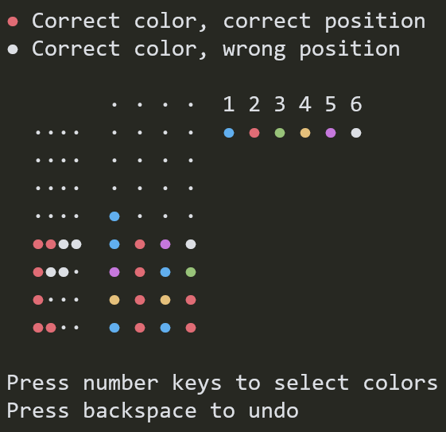

# codebreaker

[](https://github.com/mosmeh/codebreaker/actions)

A code-breaking game in terminal



## Installation

Clone this repository and run:

```sh
cargo install --path .
```

## How to play

Just start the game:

```sh
codebreaker
```

## Command-line options

```
FLAGS:
        --no-duplicate    Forbid colors to duplicate
        --help            Prints help information
    -V, --version         Prints version information

OPTIONS:
    -c, --colors <colors>      Number of colors [default: 6]
    -g, --guesses <guesses>    Maximum number of guesses [default: 8]
    -h, --holes <holes>        Number of holes per row [default: 4]
```
